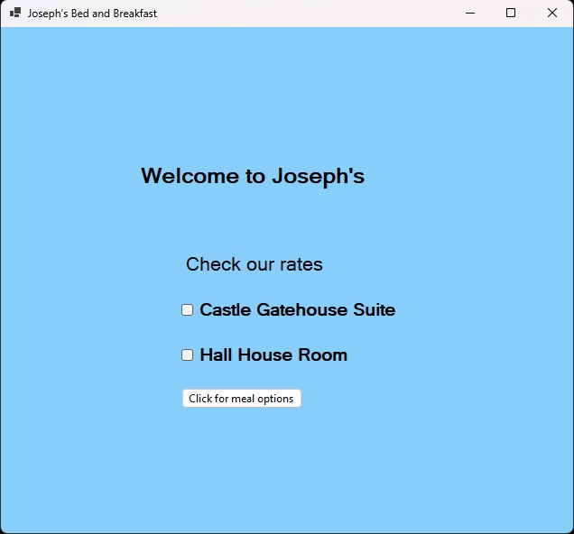
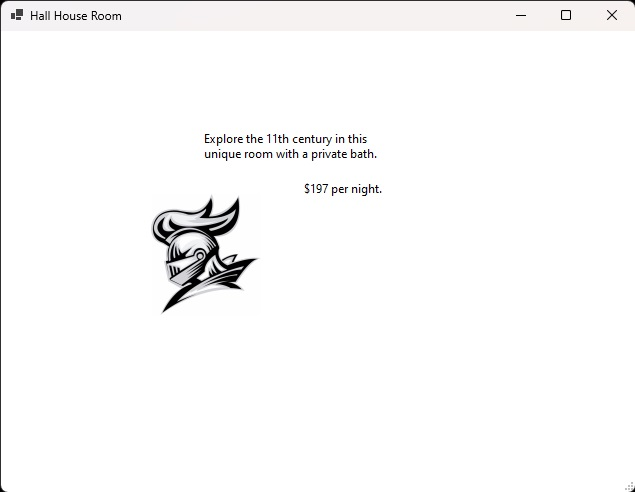
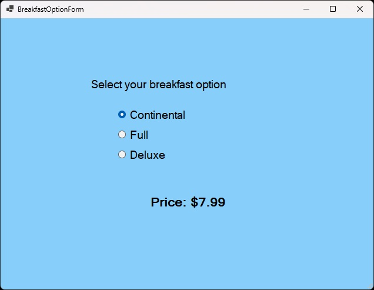

# BbForm

BbForm is an interactive menu for a Bed and Breakfast.

## Usage/Examples

# Features
- Two checkboxes containing prices for each room
  - When clicked, display room information
- Button to open the food menu
- Radio buttons and labels for food options and prices
  - When a radio button is clicked, update the current price label for the selected item
  
#

 
More Screenshots

 

